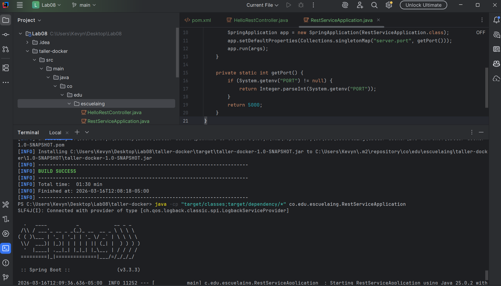
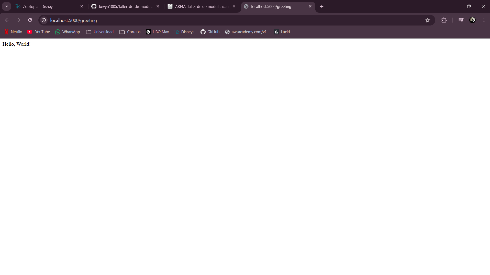
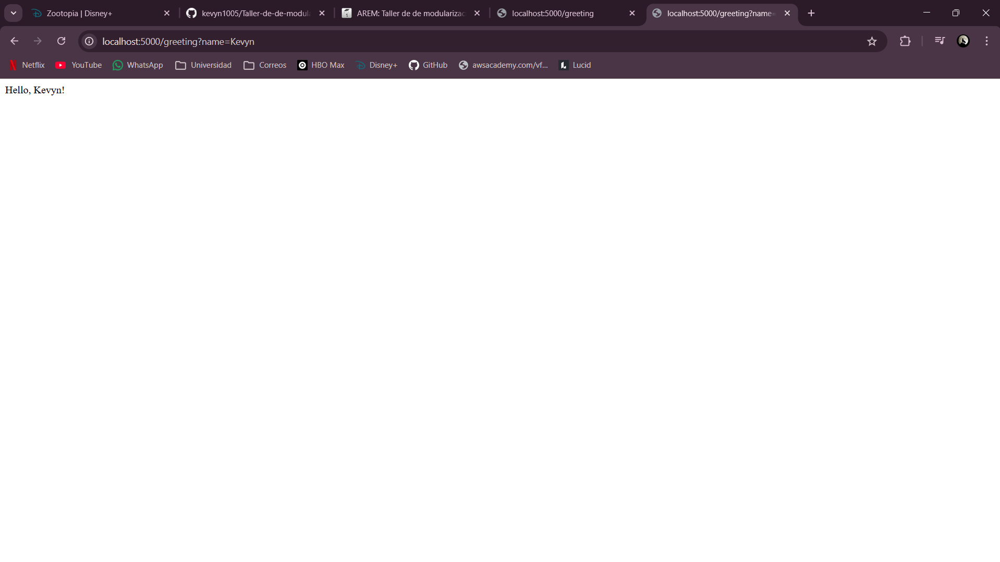
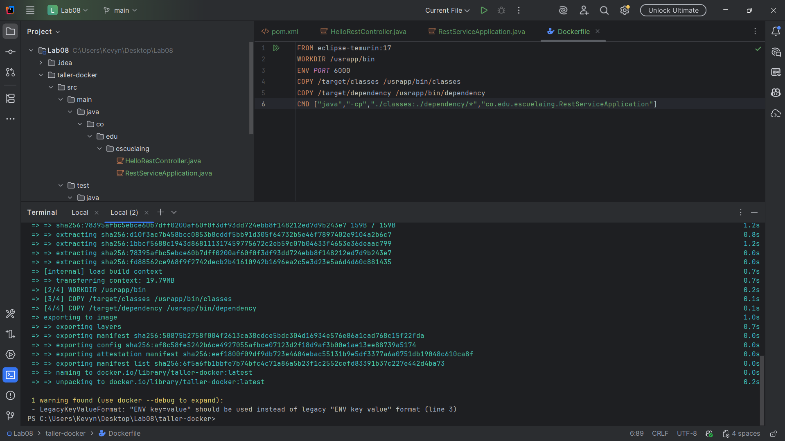
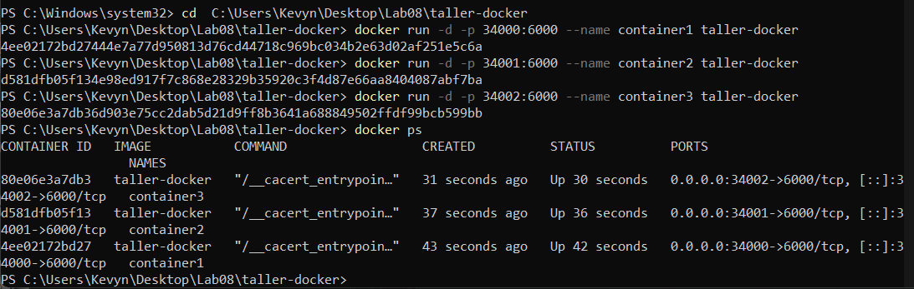
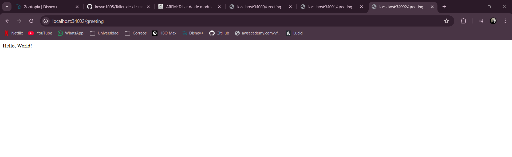
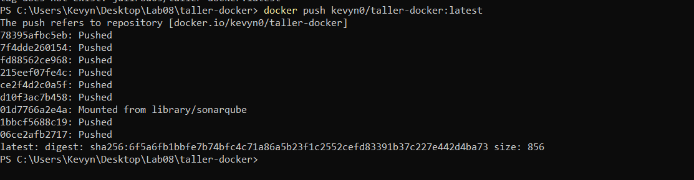
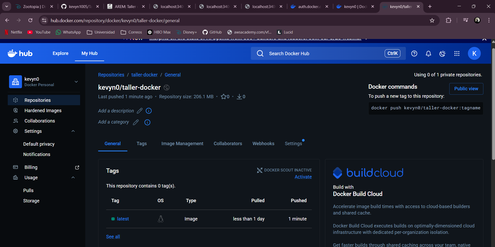
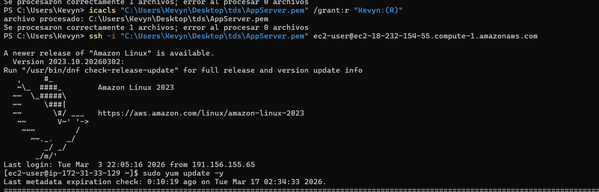
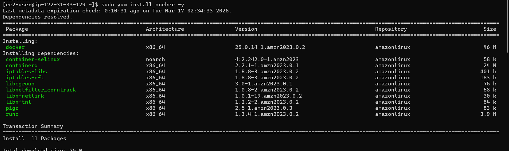

# Taller Docker + AWS — Introducción a la Virtualización con Contenedores

## ¿De qué trata este proyecto?

Este repositorio contiene el desarrollo del taller de virtualización usando Docker y AWS EC2. El objetivo fue construir una pequeña aplicación web en Java con Spring Boot, empaquetarla en un contenedor Docker, publicarla en Docker Hub y finalmente desplegarla en la nube usando una instancia EC2 de Amazon Web Services.


## ¿Cómo funciona la aplicación?

La app expone un endpoint REST sencillo:

```
GET /greeting           → Hello, World!
GET /greeting?name=Juan → Hello, Kevyn!
```

El puerto interno del contenedor es **6000**, mapeado al puerto **42000** de la máquina virtual en AWS.

---

```

---

## Paso a paso — Cómo reproducir este proyecto

### 1. Clonar el repositorio

```bash
git clone <url-del-repositorio>
cd taller-docker
```

### 2. Compilar el proyecto

```bash
mvn clean install
```

Esto genera el `.jar` y copia todas las dependencias en `target/dependency/`.

### 3. Probar localmente

```bash
java -cp "target/classes;target/dependency/*" co.edu.escuelaing.RestServiceApplication
```

Abrir en el navegador:
```
http://localhost:5000/greeting
```

---

## Generar la imagen Docker

### Dockerfile usado

```dockerfile
FROM eclipse-temurin:17
WORKDIR /usrapp/bin
ENV PORT 6000
COPY /target/classes /usrapp/bin/classes
COPY /target/dependency /usrapp/bin/dependency
CMD ["java","-cp","./classes:./dependency/*","co.edu.escuelaing.RestServiceApplication"]
```

### Construir la imagen

```bash
docker build --tag taller-docker .
```

### Ejecutar contenedores localmente

```bash
docker run -d -p 34000:6000 --name container1 taller-docker
docker run -d -p 34001:6000 --name container2 taller-docker
docker run -d -p 34002:6000 --name container3 taller-docker
```

Verificar que están corriendo:
```bash
docker ps
```

---

## Publicar en Docker Hub

```bash
docker login
docker tag taller-docker kevyn0/taller-docker
docker push kevyn0/taller-docker:latest
```

---

## Despliegue en AWS EC2
Ver video que esta en el enlace de la tarea o este
https://drive.google.com/drive/folders/1LjQe16FYZEIu60w2HORZz6yG6UHTCCxe?usp=drive_link
### Conectarse a la instancia

```bash
ssh -i "AppServer.pem" ec2-user@ec2-18-232-154-55.compute-1.amazonaws.com
```

### Instalar Docker en la instancia

```bash
sudo yum update -y
sudo yum install docker -y
sudo service docker start
sudo usermod -a -G docker ec2-user
exit
# Volver a conectarse para que los cambios tomen efecto
```

### Correr el contenedor desde Docker Hub

```bash
docker run -d -p 42000:6000 --name tallerdocker kevyn0/taller-docker
docker ps
```

### Abrir el puerto en AWS

En el Security Group de la instancia se agregó una regla de entrada:
- **Tipo:** TCP personalizado
- **Puerto:** 42000
- **Origen:** 0.0.0.0/0

### URL de acceso

```
http://ec2-18-232-154-55.compute-1.amazonaws.com:42000/greeting
```

---

## Capturas de pantalla

Las siguientes capturas muestran el proceso completo del taller:

| # | Descripción |
|---|-------------|










> Las imágenes se encuentran en la carpeta `Images/` del repositorio.
